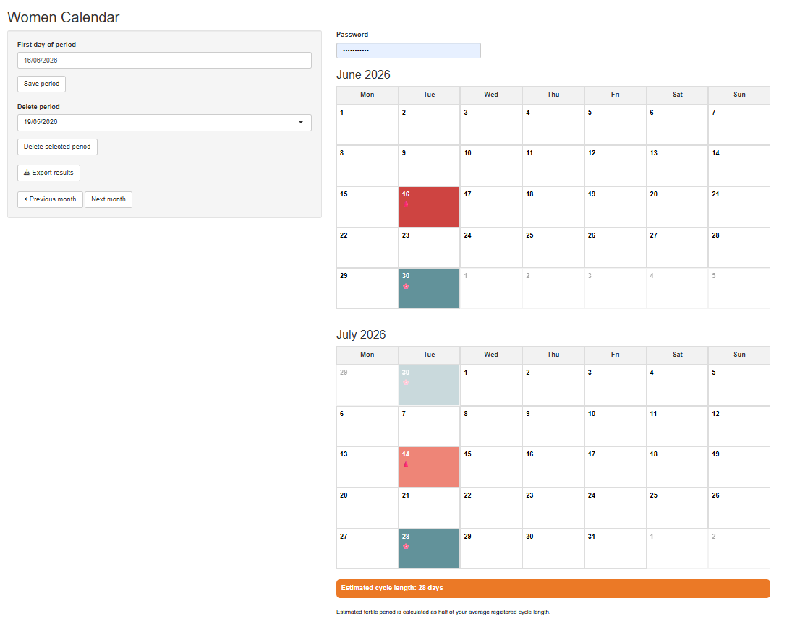
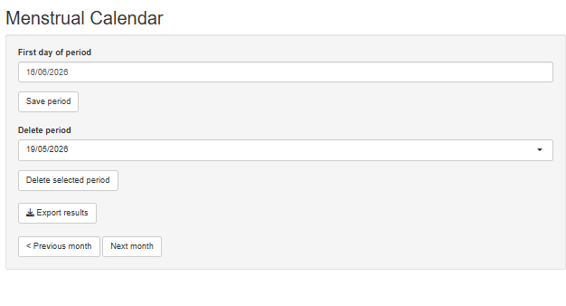

📅 Menstrual Calendar App

Simple Shiny app to register period dates and show predictions.
Your data is private because it is saved in your own Google Sheet.  
You need R Studio and a Shiny account.

## 🔗 Step 1 — Create Google Form + Sheet

## 📄 Step 1 — Create Google Sheet and Google Form

First create a Google Sheet.

Then create a Google Form with 2 short-answer questions: `date` and `action`.

In the Form, connect responses to your Sheet:

`Responses → Link to Sheets → Select existing spreadsheet`

Copy the Sheet ID from the Sheet link:

`https://docs.google.com/spreadsheets/d/SHEET_ID_HERE/edit`

🔑 To get the Form entries:

`Google Form → ⋮ → Get pre-filled link`

Fill:

`date = 16/06/2026`  
`action = add`

Copy the generated link. It will look like:

`...entry.111111=16/06/2026&entry.222222=add`

Use those `entry` values in `app.R`.

Once the app works, delete the test date `16/06/2026` from the app.

## Step 2 — Save the folder locally

💾 Save the app folder on your computer.

## ⚙️ Step 3 — Edit app.R

Replace:

```r
FORM_URL <- "YOUR_FORM_RESPONSE_URL"
CSV_URL <- "YOUR_SHEET_CSV_URL"
DATE_ENTRY <- "entry.111111"
ACTION_ENTRY <- "entry.222222"
```

with your values.

## 📦 Step 4 — Install packages

```r
install.packages(c("shiny", "lubridate",
  "dplyr", "rmarkdown", "rsconnect", "httr"
))
```

## ☁️ Step 5 — Create shinyapps.io account

Create a free account:

```text
https://www.shinyapps.io/
```

Copy your:

* name
* token
* secret

In app.R, replace:

```r
APP_PASSWORD <- "YOUR_SHINNY_PASSWORD""
```
with your shinny password.

## Step 6 — Run in R terminal
🚀 Deploy app

```r
rsconnect::setAccountInfo(
  name = "name",
  token = "token",
  secret = "secret"
)

rsconnect::deployApp(
  appDir = "PASTE_FOLDER_LOCATION_HERE/Cicloapp/Cicloapp",
  appFiles = "app.R",
  forceUpdate = TRUE
)
```

If you just want to run it locally, run in R terminal
```r
shiny::runApp("PASTE_FOLDER_LOCATION_HERE/Cicloapp") #to run localy
```
where for example PASTE_FOLDER_LOCATION_HERE ="C:/Users/userX/Desktop/Cicloapp/Cicloapp"

## Step 7 — Enjoy
## Step 7 — Enjoy

You will get a link to your app, for example:

https://userx.shinyapps.io/cicloapp/

Open the link and enter your app password.

Then you can register, view, and delete your periods.

If you find any problem, contact me.

📧 Support: **mugrabifarah@gmail.com**


### Calendar view



### Mobile view


